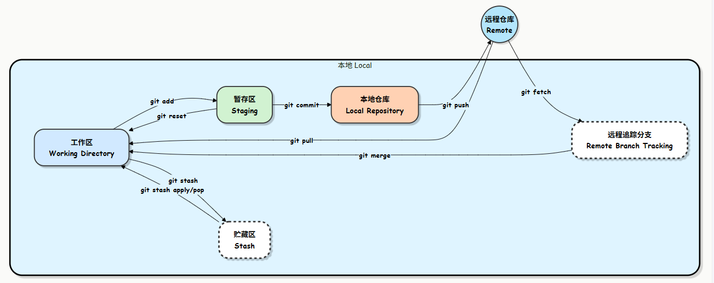

# 学习笔记：git 基础
日期：2026-05-31

## git工作流

- 工作区 (Working Directory)  
- 暂存区 (Staging Area)  
- 本地仓库 (Local Repository)  
- 远程仓库 (Remote)  
- git stash (贮藏区)： 作业写了一半，突然要改另一个急活，但又不想把没写完的作业提交。这时可以先用 stash 把代码藏进抽屉，等忙完再拿出来继续写（pop）  
**总结**： 修改代码 → add (放进篮子) → commit (存入箱子) → push (寄给远方)

## git常用命令
git add <filename>  # 添加指定文件到暂存区  
git add .           # 添加所有更改到暂存区  
git commit -m "commit message"  # 提交暂存区的更改到本地仓库  
git commit [file1] [file2] ... -m [message] # 提交暂存区指定文件的更改到本地仓库  
git status         # 查看状态，显示 newfile.txt 未跟踪  
git remote -v # 产看远程仓库  
git push <远程主机名> <本地分支名> # 本地的分支版本上传到远程并合并  